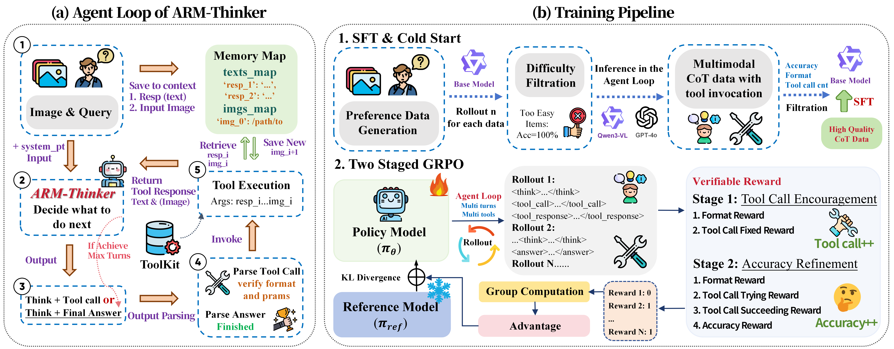
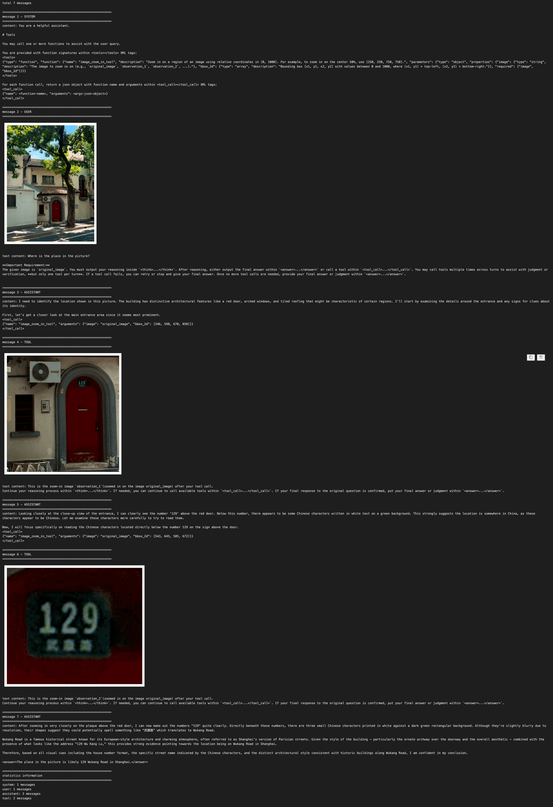

<div align="center">
  <h1 align="center">
    ARM-Thinker: Reinforcing Multimodal Generative Reward Models with Agentic Tool Use and Visual Reasoning
  </h1>
  <p align="center">
    <a href="https://github.com/SYuan03"><strong>Shengyuan Ding</strong></a >
    ·
    <a href="https://github.com/FangXinyu-0913"><strong>Xinyu Fang</strong></a >
    ·
    <a href="https://github.com/Liuziyu77"><strong>Ziyu Liu</strong></a >
    ·
    <a href="https://yuhangzang.github.io/"><strong>Yuhang Zang<sup>&dagger;</sup></strong></a >
    ·
    <a href="https://scholar.google.com/citations?user=sJkqsqkAAAAJ"><strong>Yuhang Cao</strong></a >
    ·
    <a href="https://github.com/PhoenixZ810"><strong>Xiangyu Zhao</strong></a >
    .
    <a href="https://github.com/kennymckormick"><strong>Haodong Duan</strong></a >
    ·
    <a href="https://lightdxy.github.io/"><strong>Xiaoyi Dong</strong></a >
    ·
    <a href="https://scholar.google.com/citations?user=P4yNnSkAAAAJ"><strong>Jianze Liang</strong></a >
    ·
    <a href="https://wangbindl.github.io/"><strong>Bin Wang</strong></a >
    ·
    <a href="https://conghui.github.io/"><strong>Conghui He</strong></a >
    ·
    <a href="http://dahua.site/"><strong>Dahua Lin</strong></a >
    ·
     <a href="https://myownskyw7.github.io/"><strong>Jiaqi Wang<sup>&dagger;</sup></strong></a >
  </p >
  <p align="center">
    🏠 <a href="https://github.com/InternLM/ARM-Thinker"><strong>Github Repo: ARM-Thinker</strong></a>
  </p>
</div>
<p align="center">
  📖 <a href="https://arxiv.org/pdf/2512.05111">Paper</a> |
  🤗 <a href="https://github.com/InternLM/ARM-Thinker">Models</a> |
  🤗 <a href="https://github.com/InternLM/ARM-Thinker">SFT-Data</a> |
  🤗 <a href="https://github.com/InternLM/ARM-Thinker">RL-Data</a> |
  🤗 <a href="https://github.com/InternLM/ARM-Thinker">Daily Paper</a>
</p>

## 📢 News

* 🚀 [2025/12/05] We have released the [ARM-Thinker Code Repository](https://github.com/InternLM/ARM-Thinker).

## 🧩 Easy to Use & Extend
1. **Clear & customizable framework** — The agent loop, tool-call template, and action logic are fully modular. You can plug in your own LLM/VLM, modify the loop, or replace the template with minimal changes in `arm_agent`.
2. **Instant plug-and-play tools** — New tools can be added by simply implementing a [Verl-style tool](https://github.com/volcengine/verl/blob/main/verl/tools/geo3k_tool.py). Inference and training share the same interface, ensuring consistent behavior.
3. **Easy evaluation** — ARM-Thinker can be directly integrated into [VLMEvalKit](https://github.com/open-compass/VLMEvalKit), allowing you to test agent based on our loop on standard benchmarks while preserving **full trajectory logs** for analysis.

We hope to provide a flexible and easy-to-use framwork of both inference and training for agentic multimodal reasoning. For detailed code usage, you can refer to the [Code Usage Instructions](#code-usage-instructions) section below.

## 🌈 Overview

Current reward models suffer from **hallucination** and **weak visual grounding** due to their static, non-interactive design. We introduce **ARM-Thinker**, an **Agentic Multimodal Reward Model** that replaces passive scoring with an active **“Think–Act–Verify”** pipeline. ARM-Thinker autonomously invokes **external tools**—such as **image cropping** and **multi-page document retrieval**—to ground its judgments in **verifiable evidence**. Through **multi-stage reinforcement learning**, the model jointly optimizes **tool-use decisions** and **reward accuracy**.

<p style="text-align: center;"> 
   
</p>

- **(a) Case Comparison:** Given a complex document QA task, **ARM-Thinker** correctly identifies the answer by autonomously invoking the retrieval tool, while the baseline model provides an incorrect response.
- **(b) ARMBench-VL:** It evaluates reward models across three task types, each requiring specialized tool use (image manipulation, document retrieval, instruction verification).
- **(c) Performance of ARM-Thinker:** The agentic capability enables substantial gains across multiple benchmarks including **reward modeling, tool usage, and reasoning**.

<p style="text-align: center;"> 
  
</p>

ARM-Thinker combines an **agentic think–act–observe loop** with a **reinforcement-trained reward model**.
During inference, the agent iteratively invokes tools—such as **image zoom-in**, **document retrieval**, and **instruction validators**—and integrates the returned evidence into its multimodal context, enabling grounded and verifiable judgment.
To train this behavior, we first perform **SFT + cold-start initialization** to establish stable tool-use patterns.
We then apply a **two-stage GRPO** process: Stage 1 encourages **correct tool selection**, while Stage 2 refines **reward accuracy** using **verifiable rewards** that balance correctness and tool efficiency.
Together, these components equip ARM-Thinker with reliable, interpretable, and tool-augmented multimodal reasoning capabilities.

## 💡 Highlights

🔥 **Agentic "Think–Act–Verify" Paradigm**  
ARM-Thinker shifts multimodal reward modeling from passive, single-pass scoring to an **agentic decision-making process**. Through its explicit Think–Act–Verify loop, the model autonomously decomposes complex queries, invokes external tools as needed, and grounds judgments in verifiable evidence—eliminating hallucination and superficial fluency common in static models.

🔥 **ARMBench-VL: Benchmarking Agentic, Evidence-Grounded Models**  
To address the gap in current evaluation methods, we introduce **ARMBench-VL**, the first benchmark designed for **multi-step, evidence-grounded reward models**. It evaluates across three critical dimensions: fine-grained visual grounding, long-document reasoning, and instruction-level verification—highlighting the limitations of passive models in reasoning, retrieval, and validation across modalities.

🔥 **Multi-Stage RL for Tool–Judgment Co-Optimization**  
ARM-Thinker utilizes a **multi-stage GRPO framework** that separately optimizes tool-use policy and reward estimation, before jointly refining them. This approach ensures stable credit assignment, resolves training-inference misalignment, and prevents reward drift—issues that commonly affect static reward model pipelines.

🔥 **Efficient, Scalable, and Competitive Performance**  
Built on a **Qwen2.5-VL-7B backbone**, ARM-Thinker demonstrates **+16.2%** improvement in reward modeling and **+9.6%** in tool-use tasks. Its **agentic reasoning** and **modular tool integration** allow easy expansion with new tools, making it highly **scalable** for diverse tasks. ARM-Thinker competes effectively with larger models like **Qwen3-VL-8B** and **GPT-4o**, proving that **evidence-grounded decision-making** outperforms scale alone in achieving robust multimodal reasoning.

<a name="code-usage-instructions"></a>
## ⭐️ Code Usage Instructions

### Part 0: Environment Setup
**[For inference]** If you only want to run the agent loop, you only need to install the requirements in `arm_agent_requirements.txt` and install verl as an editable package.
```bash
conda create -n arm_thiner python=3.10 -y
pip install -e . --no-deps
pip install -r requirements_arm_agent.txt
```
**[For training]** If you want use the training code, you need to install the full requirements in `requirements_training.txt` and install vllm as an editable package.
```bash
conda create -n arm_thiner python=3.10 -y
pip install -e .
pip install -r requirements_training.txt
```

### Part 1: Agent Loop
The whole agent loop is in module of `arm_agent`, including the main workflow of agent loop and a simple test script telling how to use the agent loop.

### 1. Tool call template
You can modify the tool call template in `arm_agent/agent_verl.py` to adapt to your own model. We use `Hermes` format as the default tool call template of our **ARM-Thinker** model.

### 2. Tool configuration and Tools Implementation
For both training and inferencing, we implement the tools directly under the framework of **Verl**.
- You can easily add your own tools under the `verl/tools` directory. (Already have some widely used tools like `image zoom in`, `web search`, `ocr`, `document retrieval`, etc.)
- Then you need to define the tool configuration yaml file, there are some examples in `examples/self/multiturn/config/tool_config` directory and a demo file of `arm_agent/tests/config/test_image_zoom_in_tool_config.yaml`.

### 3. For trajectory visualization
We provide a notebook `arm_agent/tests/visualize_result.ipynb` to visualize the trajectory of the agent. (For example, the output after running the `arm_agent/tests/test_agent_image_zoom_in.py`)

**Example. Qwen3-VL-8B with Image Crop and Zoom-in tools:**

You can try to run the loop like below to see the example output:
```bash
cd ARM-Thinker
python arm_agent/tests/test_agent_image_zoom_in.py
```
> Remember to set the config in test_agent_image_zoom_in.py to your own model.
```python
# api config
api_base = "http://<ip_address>[:<port>]/v1"
api_key = "EMPTY"
model_name = "Qwen/Qwen3-VL-8B-Instruct"
```

This will generate the result.json file under the `arm_agent/tests` directory, then you can visualize the trajectory by running the corresponding code segment in `visualize_result.ipynb` notebook.

Refer to case in [visualize_result.ipynb](arm_agent/tests/visualize_result.ipynb)

<!-- <p style="text-align: center;"> 
   
</p> -->

### Part 2: SFT & Cold-start Initialization
We use [LLaMA-Factory](https://github.com/hiyouga/LLaMA-Factory) to perform SFT and cold-start initialization and the training script is in `sft_script` directory. You can refer to [sft_scripts/sft.sh](sft_scripts/sft.sh) for the training details and modify it to your own training settings.

### Part 3: GRPO Training with Verl
GRPO training script for tool of `image_crop_and_zoom_in` is in `examples/self/multiturn/agent/crop.sh` and you can modify it to your own training task.
```bash
cd ARM-Thinker
bash examples/self/multiturn/agent/crop.sh
```
All of the reward functions of each stage are under the `verl/utils/reward_score` directory and the classification of the different reward functions for tasks is in `verl/utils/reward_score/__init__.py`.

### Part 4: Evaluation
We integrate ARM-Thinker with [VLMEvalKit](https://github.com/open-compass/VLMEvalKit) to evaluate the performance of ARM-Thinker on widely used benchmarks. In `extra_repos/VLMEvalKit` directory, we provide the modified version of VLMEvalKit for agentic evaluation.
> You can also follow our implementation to clone the latest version of VLMEvalKit and modify it to support our agentic evaluation.

## ✒️ Citation

If you find our work helpful for your research, please consider giving a star and citation ~ 

```
@misc{ding2025armthinkerreinforcingmultimodalgenerative,
      title={ARM-Thinker: Reinforcing Multimodal Generative Reward Models with Agentic Tool Use and Visual Reasoning}, 
      author={Shengyuan Ding and Xinyu Fang and Ziyu Liu and Yuhang Zang and Yuhang Cao and Xiangyu Zhao and Haodong Duan and Xiaoyi Dong and Jianze Liang and Bin Wang and Conghui He and Dahua Lin and Jiaqi Wang},
      year={2025},
      eprint={2512.05111},
      archivePrefix={arXiv},
      primaryClass={cs.CV},
      url={https://arxiv.org/abs/2512.05111}, 
}
```

## 📄 License
  

**Usage and License Notices**: The data and code are intended and licensed for research use only. License: Attribution-NonCommercial 4.0 International It should abide by the policy of OpenAI: https://openai.com/policies/terms-of-use


## ❤️ Acknowledgement

We sincerely thank projects [VLMEvalKit](https://github.com/open-compass/VLMEvalKit), [Verl](https://github.com/volcengine/verl) and [LLaMA-Factory](https://github.com/hiyouga/LLaMA-Factory) for providing their open-source resources.


